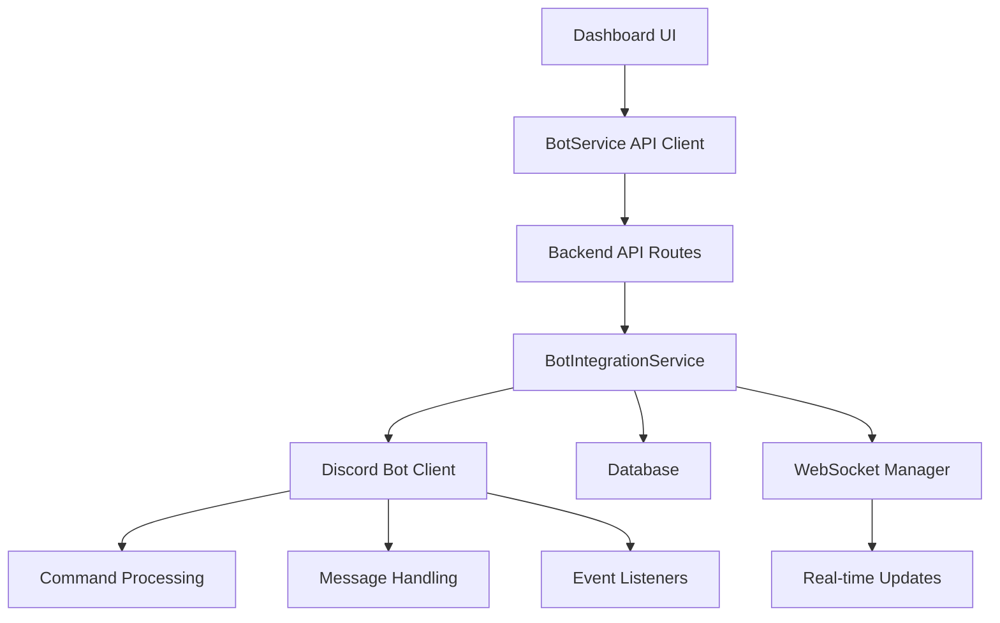

# 🎛️ Dashboard Bot Control Implementation

> **Complete guide to how the dashboard controls the Discord bot**

## Overview

The dashboard now has full control over the Discord bot through a comprehensive integration system. This document explains how the control mechanisms work and how to use them.

## Architecture



## Key Features

### 1. Bot Status Control ✅

**Dashboard Control:**
- Toggle bot online/offline status
- View real-time bot statistics
- Monitor bot health and uptime

**Implementation:**
```typescript
// Dashboard hook usage
const { status, toggleBotStatus, isToggling } = useBotStatus();

// Toggle bot status
await toggleBotStatus(true);  // Start bot
await toggleBotStatus(false); // Stop bot
```

**Backend Processing:**
- Updates `isBotEnabled` flag in `BotIntegrationService`
- Stores status in database for persistence
- Emits WebSocket events for real-time updates
- Bot commands are disabled when `isBotEnabled = false`

### 2. Server Settings Management ⚙️

**Dashboard Control:**
- Configure bot prefix, language, timezone
- Set admin/moderator roles
- Enable/disable features per server
- Configure log channels

**Implementation:**
```typescript
// Dashboard hook usage
const { settings, updateSettings } = useServerBotSettings(serverId);

// Update server settings
await updateSettings({
  prefix: '!',
  language: 'en',
  features: {
    killTracker: true,
    leaderboard: true,
    customCommands: false
  }
});
```

**Backend Processing:**
- Updates `server_settings` table
- Updates `server_feature_settings` table
- Emits `serverSettingsUpdate` event
- Settings are applied immediately to bot behavior

### 3. Command Management 🎮

**Dashboard Control:**
- View all available commands
- Enable/disable specific commands
- Set command cooldowns
- Configure command permissions

**Implementation:**
```typescript
// Dashboard hook usage
const { commands, updateCommand } = useServerCommands(serverId);

// Update command settings
await updateCommand('stats', {
  enabled: true,
  cooldown: 5,
  permissions: ['everyone']
});
```

**Backend Processing:**
- Updates `server_commands` table
- Emits `commandUpdate` event
- Command permissions are checked before execution

### 4. Message Sending 💬

**Dashboard Control:**
- Send messages to any Discord channel
- Create rich embeds with fields
- Send announcements and notifications

**Implementation:**
```typescript
// Dashboard hook usage
const { sendMessage } = useServerInfo(serverId);

// Send message with embed
await sendMessage({
  channelId: '123456789',
  message: 'Hello from dashboard!',
  embed: {
    title: 'Dashboard Update',
    description: 'Settings have been updated',
    color: '#00ff00'
  }
});
```

**Backend Processing:**
- Validates channel permissions
- Creates Discord embed objects
- Sends message through Discord client
- Logs all sent messages

## Real-time Updates

### WebSocket Events

The system provides real-time updates through WebSocket connections:

```typescript
// Bot status updates
socket.on('bot_status_update', (status) => {
  // Update UI with new bot status
});

// Server settings updates
socket.on('server_settings_update', (data) => {
  // Update UI with new settings
});

// Command updates
socket.on('command_update', (data) => {
  // Update UI with command changes
});

// Guild events
socket.on('guild_join', (guild) => {
  // Bot joined a new server
});

socket.on('guild_leave', (guild) => {
  // Bot left a server
});
```

## Security & Permissions

### Authentication
- All bot control endpoints require valid JWT tokens
- Admin endpoints require `admin` permission
- Server-specific endpoints require `manage_server` permission

### Authorization
- Server owners can only control their own servers
- Admins can control bot status globally
- Command permissions are enforced at runtime

## Database Schema

### Bot Settings
```sql
CREATE TABLE bot_settings (
  id SERIAL PRIMARY KEY,
  setting_key VARCHAR(255) UNIQUE,
  setting_value TEXT,
  updated_at TIMESTAMP DEFAULT NOW()
);
```

### Server Settings
```sql
CREATE TABLE server_settings (
  id VARCHAR(255) PRIMARY KEY,
  server_id VARCHAR(255) UNIQUE,
  prefix VARCHAR(10) DEFAULT '!',
  language VARCHAR(10) DEFAULT 'en',
  timezone VARCHAR(50) DEFAULT 'UTC',
  log_channel VARCHAR(255),
  admin_role VARCHAR(255),
  moderator_role VARCHAR(255),
  auto_delete_messages BOOLEAN DEFAULT false,
  updated_at TIMESTAMP DEFAULT NOW()
);
```

### Feature Settings
```sql
CREATE TABLE server_feature_settings (
  id VARCHAR(255) PRIMARY KEY,
  server_id VARCHAR(255),
  feature_id VARCHAR(255),
  is_enabled BOOLEAN DEFAULT true,
  updated_at TIMESTAMP DEFAULT NOW(),
  UNIQUE(server_id, feature_id)
);
```

## API Endpoints

### Bot Control
- `GET /bot/status` - Get bot status and statistics
- `PATCH /bot/toggle` - Toggle bot online/offline (admin only)
- `GET /bot/statistics` - Get detailed bot statistics (admin only)
- `POST /bot/broadcast` - Broadcast dashboard update (admin only)

### Server Management
- `GET /bot/servers/:serverId/settings` - Get server bot settings
- `PATCH /bot/servers/:serverId/settings` - Update server bot settings
- `GET /bot/servers/:serverId/commands` - Get server commands
- `PATCH /bot/servers/:serverId/commands/:commandId` - Update server command
- `POST /bot/servers/:serverId/send-message` - Send message to server
- `GET /bot/servers/:serverId/info` - Get server information

## Testing

A comprehensive test script is available at `backend/test-bot-control.js`:

```bash
# Set environment variables
export API_BASE_URL="http://localhost:3001"
export WS_URL="ws://localhost:3001"
export TEST_TOKEN="your-test-token"

# Run tests
node backend/test-bot-control.js
```

The test script verifies:
- Bot status retrieval and toggling
- WebSocket connection and real-time updates
- Server settings management
- Command management
- Message sending functionality

## Error Handling

### Common Error Scenarios
1. **Bot Offline**: Commands return "Bot Temporarily Disabled" message
2. **Invalid Permissions**: 403 errors with clear permission requirements
3. **Server Not Found**: 404 errors for invalid server IDs
4. **Channel Access**: Failed message sending due to permissions

### Error Responses
```json
{
  "error": "Access denied or server not found",
  "code": "ACCESS_DENIED"
}
```

## Monitoring & Logging

### Log Events
- Bot status changes
- Server settings updates
- Command modifications
- Message sending attempts
- WebSocket connections

### Metrics
- Bot uptime and status
- Server count and user count
- Command usage statistics
- Message delivery success rates

## Best Practices

### Dashboard Usage
1. Always check bot status before sending commands
2. Use real-time updates to keep UI in sync
3. Handle errors gracefully with user feedback
4. Implement proper loading states

### Backend Development
1. Always validate permissions before processing
2. Emit events for all state changes
3. Use database transactions for consistency
4. Log all bot control actions

### Security
1. Never expose admin endpoints to regular users
2. Validate all input data
3. Use rate limiting on control endpoints
4. Monitor for suspicious activity

## Troubleshooting

### Common Issues

**Bot Not Responding to Toggle:**
- Check if `BotIntegrationService` is properly initialized
- Verify database connection
- Check WebSocket connection status

**Settings Not Updating:**
- Verify user has `manage_server` permission
- Check server ownership in database
- Ensure proper database schema

**Messages Not Sending:**
- Verify bot has channel permissions
- Check channel ID validity
- Ensure bot is online and ready

**WebSocket Disconnections:**
- Check network connectivity
- Verify WebSocket server is running
- Monitor for rate limiting

## Future Enhancements

### Planned Features
1. **Bot Health Monitoring**: Detailed health checks and diagnostics
2. **Command Analytics**: Usage statistics and performance metrics
3. **Bulk Operations**: Mass server configuration updates
4. **Bot Clustering**: Support for multiple bot instances
5. **Advanced Permissions**: Role-based command access control

### Integration Opportunities
1. **Discord Audit Logs**: Track all bot actions
2. **External Monitoring**: Integration with monitoring services
3. **Automated Backups**: Regular configuration backups
4. **Migration Tools**: Server configuration migration utilities

---

## Summary

The dashboard now has complete control over the Discord bot through a robust, secure, and real-time integration system. All major bot functions can be controlled from the web interface, with proper authentication, authorization, and error handling in place.

The system is designed to be:
- **Secure**: Proper authentication and authorization
- **Real-time**: WebSocket updates for immediate feedback
- **Reliable**: Database persistence and error handling
- **Scalable**: Designed for multiple servers and users
- **Maintainable**: Clean separation of concerns and comprehensive logging
