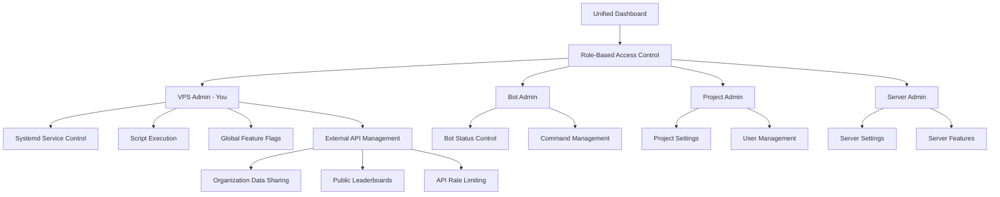

# 🎛️ Unified Dashboard System - Complete Implementation

> **Complete guide to your unified dashboard with role-based access, systemd integration, and external API management**

## Overview

Your unified dashboard system provides complete control over your entire infrastructure with role-based access control, systemd service management, feature flags, and external API user management for organizations using your kill tracker.

## System Architecture



## Role-Based Access Control

### 1. **VPS Admin (You)**
- **Full system control** over all projects and services
- **Systemd service management** - start/stop/restart services
- **Script execution** - deploy, backup, toggle commands
- **Global feature flags** - control features across all projects
- **External API management** - create/manage organization API users
- **Emergency controls** - system shutdown, maintenance mode

### 2. **Bot Admin**
- **Bot status control** - start/stop Discord bot
- **Bot-wide settings** - global bot configuration
- **Command management** - enable/disable commands globally
- **Bot analytics** - view bot performance and usage

### 3. **Project Admin**
- **Project-specific features** - manage features per project (dbot, api, millsy)
- **User management** - manage users within projects
- **Project analytics** - view project-specific statistics
- **API rate limiting** - configure rate limits per project

### 4. **Server Admin (Discord Server Owners)**
- **Server settings** - configure bot for their Discord server
- **Server features** - enable/disable features for their server
- **Server commands** - manage command permissions for their server
- **Server analytics** - view server-specific statistics

## External API User Management

### Organization Data Sharing

Your system now supports **external organizations** that want to use your kill tracker API to feed data to their own systems and leaderboards.

**Features:**
- **API Key Authentication** - Secure API access for organizations
- **Data Sharing Controls** - Organizations can control what data they share
- **Organization Leaderboards** - Each org gets their own leaderboard
- **Public Leaderboards** - Aggregated public statistics
- **Rate Limiting** - Configurable API rate limits per organization
- **Data Anonymization** - Optional data anonymization for privacy

**Data Sharing Settings:**
```typescript
interface DataSharingSettings {
  shareKills: boolean;           // Share kill data
  shareDeaths: boolean;          // Share death data
  shareStats: boolean;           // Share statistics
  shareLocation: boolean;        // Share location data
  shareWeapon: boolean;          // Share weapon data
  sharePvPOnly: boolean;         // Only share PvP data
  sharePvEOnly: boolean;         // Only share PvE data
  excludeSuicides: boolean;      // Exclude suicide deaths
  excludeEnvironmental: boolean; // Exclude environmental deaths
  anonymizeData: boolean;        // Anonymize player names
  shareWithProviders: boolean;   // Share with third-party providers
}
```

## API Endpoints

### Admin Endpoints (VPS Admin Only)

```typescript
// External API User Management
POST   /admin/external-api/users              // Create new organization
GET    /admin/external-api/users              // List all organizations
PUT    /admin/external-api/users/:id          // Update organization
GET    /admin/external-api/users/:id          // Get organization details
GET    /admin/external-api/stats              // Get API usage statistics

// System Management
GET    /vps/services                          // Get systemd services
POST   /vps/services/:name/control            // Control service (start/stop/restart)
GET    /vps/resources                         // Get system resources
GET    /vps/scripts                           // Get executable scripts
POST   /vps/scripts/:id/execute               // Execute script
GET    /vps/scripts/executions                // Get script execution history

// Feature Flag Management
GET    /vps/features                          // Get all feature flags
POST   /vps/features                          // Create feature flag
PUT    /vps/features/:id                      // Update feature flag
DELETE /vps/features/:id                      // Delete feature flag
```

### External API Endpoints (API Key Authentication)

```typescript
// Data Submission
POST   /external-api/kills                    // Submit kill data
POST   /external-api/deaths                   // Submit death data

// Organization Data
GET    /external-api/leaderboard              // Get organization leaderboard
GET    /external-api/stats                    // Get organization statistics
GET    /external-api/players                  // Get organization players
```

### Public Endpoints (No Authentication)

```typescript
// Public Data
GET    /public/leaderboards                   // Get public leaderboards
GET    /public/organizations/:id/stats        // Get organization public stats
GET    /public/weapons                        // Get weapon statistics
GET    /public/locations                      // Get location statistics
```

## Prebuilt Scripts

### 1. **Deploy Discord Bot** (`scripts/deploy-dbot.sh`)
```bash
./deploy-dbot.sh --environment=production --force=false --backup=true
```
- Pulls latest code from git
- Installs dependencies
- Runs database migrations
- Builds and starts the bot
- Creates backups before deployment

### 2. **Toggle Commands** (`scripts/toggle-command.sh`)
```bash
./toggle-command.sh --command=stats --enabled=true --server_id=123456789
./toggle-command.sh --command=leaderboard --enabled=false --global=true
```
- Enable/disable commands globally or per-server
- Updates database and feature flags
- Restarts bot to apply changes

### 3. **Restart Services** (`scripts/restart-services.sh`)
```bash
./restart-services.sh --services=dbot2-backend,nginx,postgresql
```
- Safely restart systemd services
- Health checks after restart
- Error handling and logging

### 4. **Database Backup** (`scripts/backup-db.sh`)
```bash
./backup-db.sh --backup_name=manual_backup_$(date +%Y%m%d) --compress=true
```
- Creates database backups
- Compresses backup files
- Cleans up old backups
- Verifies backup integrity

## Feature Flag System

### Namespace-Aware Flags

Feature flags are organized by namespaces for different projects:

```typescript
// Format: namespace.level.feature.description
'dbot.bot.online'                    // Discord bot online status
'dbot.commands.killtracker'          // Kill tracker command
'dbot.server.features.leaderboard'   // Leaderboard feature per server
'api.rate.limiting'                  // API rate limiting
'api.features.webhooks'              // Webhook features
'millsy.ui.darkMode'                 // Dark mode for portfolio
'millsy.features.analytics'          // Analytics features
'global.vps.maintenanceMode'         // Global maintenance mode
```

### Flag Levels

1. **VPS Level** - System-wide controls (maintenance mode, emergency shutdowns)
2. **Bot Level** - Bot-wide settings (online status, global commands)
3. **Project Level** - Project-specific features (per subdomain)
4. **Server Level** - Per-Discord server settings

### Rollout Strategies

- **Simple Toggle** - On/off for all users
- **Percentage Rollout** - Gradually enable for X% of users
- **Target Users** - Enable for specific Discord user IDs
- **Target Servers** - Enable for specific Discord server IDs
- **Custom Conditions** - Advanced targeting rules

## Dashboard Interface

### Role-Based Sections

**VPS Admin Panel:**
- System overview with resource usage
- Systemd service management
- Executable scripts with safety warnings
- Global feature flag management
- External API user management
- Emergency controls

**Bot Admin Panel:**
- Bot status and control
- Bot-wide feature flags
- Command management
- Bot analytics and logs

**Project Admin Panel:**
- Project-specific settings
- User management per project
- Project analytics
- API configuration

**Server Admin Panel:**
- Server-specific bot settings
- Server feature toggles
- Server command management
- Server analytics

### Safety Features

- **Dangerous Script Warnings** - Clear warnings for potentially harmful operations
- **Confirmation Dialogs** - Require confirmation for critical actions
- **Audit Logging** - Log all administrative actions
- **Permission Validation** - Verify permissions before executing actions
- **Rollback Capabilities** - Ability to rollback changes

## Security & Permissions

### Permission System

```typescript
const PERMISSIONS = {
  VPS_ADMIN: [
    'vps:system:control',      // Full system control
    'vps:features:manage',     // Manage all feature flags
    'vps:admins:grant',        // Grant admin roles
    'vps:emergency:shutdown',  // Emergency shutdown
    'vps:scripts:execute',     // Execute system scripts
    'vps:services:manage',     // Manage systemd services
    'global:features:manage'   // Global feature management
  ],
  BOT_ADMIN: [
    'bot:status:control',      // Control bot status
    'bot:features:manage',     // Manage bot features
    'bot:commands:manage',     // Manage commands
    'bot:analytics:view'       // View bot analytics
  ],
  PROJECT_ADMIN: [
    'project:features:manage', // Manage project features
    'project:users:manage',    // Manage project users
    'project:analytics:view'   // View project analytics
  ],
  SERVER_ADMIN: [
    'server:settings:manage',  // Manage server settings
    'server:features:manage',  // Manage server features
    'server:commands:manage'   // Manage server commands
  ]
};
```

### Authentication

- **Discord OAuth** - Primary authentication method
- **API Key Authentication** - For external API users
- **JWT Tokens** - Secure session management
- **Role-based Access** - Contextual permissions based on user role

## Usage Examples

### 1. **Deploy New Bot Version (VPS Admin)**
```typescript
// Via Dashboard
1. Navigate to VPS Admin Panel
2. Go to System Scripts
3. Click "Execute" on "Deploy Discord Bot"
4. Set parameters: environment=production, force=false, backup=true
5. Confirm execution
6. Monitor deployment progress
```

### 2. **Toggle Command for Development (VPS Admin)**
```typescript
// Via Dashboard
1. Navigate to VPS Admin Panel
2. Go to System Scripts
3. Click "Execute" on "Toggle Command (Dev)"
4. Set parameters: command=stats, enabled=false, server_id=YOUR_SERVER_ID
5. Confirm execution
6. Command is now disabled for your server only
```

### 3. **Create External API User (VPS Admin)**
```typescript
// Via Dashboard
1. Navigate to VPS Admin Panel
2. Go to External API Management
3. Click "Create Organization"
4. Fill in organization details
5. Configure data sharing settings
6. Set rate limits
7. Generate API key
8. Provide API key to organization
```

### 4. **Organization Submits Kill Data**
```typescript
// External API Usage
POST /external-api/kills
Authorization: Bearer ext_abc123...
Content-Type: application/json

{
  "killerName": "PlayerOne",
  "victimName": "PlayerTwo",
  "weaponName": "Laser Rifle",
  "locationName": "Port Olisar",
  "isPvP": true,
  "timestamp": "2024-01-15T10:30:00Z"
}
```

### 5. **Organization Gets Leaderboard**
```typescript
// External API Usage
GET /external-api/leaderboard
Authorization: Bearer ext_abc123...

Response:
{
  "success": true,
  "data": {
    "organizationId": "ext_org_123",
    "organizationName": "Test Organization",
    "totalKills": 1250,
    "totalDeaths": 890,
    "killDeathRatio": 1.40,
    "topKillers": [...],
    "topWeapons": [...],
    "topLocations": [...],
    "lastUpdated": "2024-01-15T10:30:00Z"
  }
}
```

## Monitoring & Analytics

### System Health Monitoring
- **Service Status** - Real-time systemd service monitoring
- **Resource Usage** - CPU, memory, disk usage tracking
- **Error Logging** - Comprehensive error logging and alerting
- **Performance Metrics** - Response times and throughput monitoring

### API Usage Analytics
- **Request Tracking** - Monitor API usage per organization
- **Rate Limit Monitoring** - Track rate limit violations
- **Error Rate Analysis** - Monitor API error rates
- **Usage Patterns** - Analyze usage patterns and trends

### Feature Flag Analytics
- **Flag Usage** - Track feature flag evaluations
- **Rollout Performance** - Monitor rollout success rates
- **A/B Test Results** - Analyze A/B test outcomes
- **User Impact** - Measure feature impact on users

## Best Practices

### Security
1. **Principle of Least Privilege** - Users only get necessary permissions
2. **Regular Permission Audits** - Review and update permissions regularly
3. **Secure Script Execution** - Validate all script parameters
4. **API Rate Limiting** - Prevent abuse with proper rate limits
5. **Data Anonymization** - Protect user privacy with anonymization options

### Operations
1. **Backup Before Changes** - Always backup before major changes
2. **Gradual Rollouts** - Use percentage rollouts for new features
3. **Monitor System Health** - Keep an eye on system resources
4. **Document Changes** - Document all administrative actions
5. **Test in Staging** - Test changes in staging environment first

### Development
1. **Feature Flag Everything** - Use feature flags for all new features
2. **Namespace Organization** - Keep feature flags organized by namespace
3. **Clear Naming** - Use descriptive names for feature flags
4. **Regular Cleanup** - Remove unused feature flags
5. **Monitor Performance** - Track feature flag evaluation performance

## Troubleshooting

### Common Issues

**Bot Not Responding to Toggle:**
- Check if `BotIntegrationService` is properly initialized
- Verify database connection
- Check WebSocket connection status
- Review bot logs for errors

**Script Execution Failed:**
- Verify script permissions and paths
- Check systemd service status
- Review script logs for errors
- Ensure proper parameters are provided

**External API Authentication Failed:**
- Verify API key is correct and active
- Check organization status (active/inactive)
- Review rate limit settings
- Check API usage logs

**Feature Flag Not Working:**
- Verify flag is enabled and properly configured
- Check rollout percentage and targeting
- Review flag evaluation logs
- Ensure proper namespace and level

## Future Enhancements

### Planned Features
1. **Advanced Analytics** - Detailed analytics and reporting
2. **Automated Deployments** - CI/CD integration
3. **Multi-Environment Support** - Staging, production environments
4. **Advanced Rate Limiting** - Dynamic rate limiting based on usage
5. **Real-time Notifications** - WebSocket notifications for system events
6. **Mobile Dashboard** - Mobile-responsive dashboard interface
7. **API Documentation** - Interactive API documentation
8. **Webhook Integration** - Webhook support for external integrations

### Integration Opportunities
1. **Discord Audit Logs** - Integration with Discord audit logs
2. **External Monitoring** - Integration with monitoring services
3. **Automated Backups** - Scheduled backup automation
4. **Migration Tools** - Database migration utilities
5. **Performance Optimization** - Automated performance optimization

---

## Summary

Your unified dashboard system provides:

✅ **Complete Infrastructure Control** - Manage all services and projects from one place  
✅ **Role-Based Access Control** - Secure access based on user roles and permissions  
✅ **Systemd Integration** - Direct control over system services  
✅ **Script Execution** - Safe execution of administrative scripts  
✅ **Feature Flag Management** - Granular control over feature rollouts  
✅ **External API Management** - Support for organizations using your API  
✅ **Data Sharing Controls** - Flexible data sharing with privacy protection  
✅ **Public Leaderboards** - Aggregated public statistics  
✅ **Comprehensive Monitoring** - System health and performance monitoring  
✅ **Security & Auditing** - Complete audit trail of all actions  

The system is designed to scale with your projects and provide you with complete control over your infrastructure while maintaining security and flexibility for future growth.
