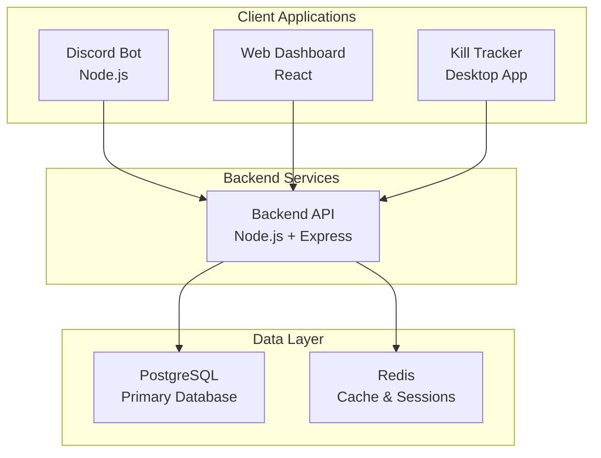

# 🚀 Complete Feature Set - Star Citizen Kill Tracker

> **Comprehensive documentation of all features and capabilities**

## 📊 **Project Overview**

The Star Citizen Kill Tracker is a **full-stack Discord bot ecosystem** with web dashboard, desktop application, and comprehensive API. It's designed to track Star Citizen gameplay, manage Discord servers, and provide analytics for the Star Citizen community.

## 🏗️ **System Architecture**

## 🤖 **Discord Bot Features**

### **Core Commands**

- **`/help`** - Show all available commands and help

- **`/ping`** - Test bot connectivity and response time

- **`/stats`** - Display server kill statistics

- **`/leaderboard`** - Show kill leaderboards (kills, deaths, K/D ratio)

- **`/mykills`** - Personal kill statistics and history

### **Star Citizen Data Commands**

- **`/ship <name>`** - Get detailed ship information

- **`/player <handle>`** - Look up player statistics

- **`/location <name>`** - Get location/system information

- **`/fleet`** - Manage personal fleet (add, list, remove, value)

- **`/org`** - Organization information and management

### **Server Management Commands**

- **`/server setup`** - Initial server configuration

- **`/server settings`** - View/update server settings

- **`/server toggle <feature>`** - Enable/disable features

- **`/server channel <type> <channel>`** - Set notification channels

### **Privacy & User Commands**

- **`/privacy`** - View current privacy settings

- **`/privacy set <level>`** - Change privacy level (public/private/friends)

- **`/privacy optout/optin`** - Opt out/in of kill tracking

### **API Management Commands**

- **`/apikey create`** - Generate new API key

- **`/apikey list`** - View all API keys

- **`/apikey revoke`** - Revoke API key

### **Economy System Commands**

- **`/balance`** - Check user balance and economy stats

- **`/daily`** - Claim daily reward

- **`/work <job>`** - Complete jobs to earn credits

- **`/gamble <amount>`** - Gamble credits (with risk/reward)

- **`/shop`** - View available items to purchase

### **AI-Powered Features**

- **`/ai ask <question>`** - Ask AI questions about Star Citizen

- **`/ai analyze <text>`** - AI content analysis

- **`/ai moderate`** - AI-powered moderation assistance

### **Advanced Features**

- **Real-time kill notifications** - Instant Discord notifications

- **Role-based permissions** - Owner, Admin, Moderator, Member levels

- **Multi-server support** - Manage multiple Discord servers

- **Custom command creation** - Create server-specific commands

- **Webhook integration** - Send data to external services

## 🌐 **Web Dashboard Features**

### **Public Website (Landing Page)**

- **Hero section** with feature overview

- **Feature showcase** with interactive demos

- **Statistics display** (total users, kills, servers)

- **Download links** for desktop app

- **Documentation links** and support

- **Responsive design** for all devices

### **User Dashboard**

- **Personal statistics** - Kills, deaths, K/D ratio, rank

- **Recent activity** - Latest kills and events

- **Privacy controls** - Data visibility settings

- **API key management** - Create and manage API keys

- **Notification preferences** - Customize alerts

- **Account settings** - Profile management

### **Server Owner Dashboard**

- **Server overview** - Member count, activity, settings

- **Bot configuration** - Commands, features, channels

- **User management** - Member roles and permissions

- **Analytics** - Server-specific statistics

- **Message broadcasting** - Send announcements

- **Integration settings** - Webhooks, external services

### **Admin Dashboard**

- **System overview** - Global statistics and health

- **Bot management** - Start/stop, restart, status

- **User administration** - Global user management

- **Server monitoring** - All connected servers

- **Analytics** - System-wide performance metrics

- **Feature toggles** - Enable/disable system features

### **Analytics Dashboard**

- **Kill trends** - Time-based kill analysis

- **Weapon statistics** - Most used weapons

- **Location data** - Popular kill locations

- **User activity** - Player engagement metrics

- **Server performance** - Server-specific analytics

- **Real-time charts** - Live data visualization

### **Settings & Configuration**

- **Theme customization** - Dark/light mode, custom themes

- **Notification settings** - Email, Discord, in-app alerts

- **Privacy controls** - Data sharing preferences

- **API configuration** - External service integration

- **Security settings** - Two-factor auth, session management

## 💻 **Desktop Application Features**

### **Core Functionality**

- **Real-time log monitoring** - Continuous Star Citizen log watching

- **Automatic kill detection** - Parse game logs for kill events

- **In-game overlay** - Transparent overlay showing kill feed

- **System tray integration** - Background operation

- **Discord integration** - Send notifications to Discord

### **Advanced Features**

- **Multi-event tracking** - Spawns, locations, weapons, ships, missions

- **Smart log parsing** - Advanced regex patterns for accurate detection

- **Performance optimized** - Minimal resource usage

- **Cross-platform** - Windows, macOS, Linux support

- **Modular architecture** - Easy expansion to other games

### **User Interface**

- **Modern UI** - Beautiful, responsive interface with dark theme

- **Real-time updates** - Live kill feed with animations

- **Statistics dashboard** - Comprehensive stats and analytics

- **Settings management** - Configurable log paths and preferences

- **Overlay controls** - Toggle visibility and positioning

### **Log Parsing Capabilities**

- **PvP Kills** - Player vs Player combat

- **PvE Kills** - Player vs Environment

- **Suicides** - Self-inflicted deaths

- **Environmental deaths** - Environmental damage

- **Ship events** - Vehicle boarding and piloting

- **Mission events** - Quest and objective tracking

## 🔌 **API Features**

### **Authentication & Authorization**

- **JWT-based authentication** - Secure token-based auth

- **Discord OAuth integration** - Login with Discord

- **Role-based access control** - Granular permissions

- **API key management** - Generate and manage API keys

- **Rate limiting** - Prevent abuse and ensure stability

### **Core API Endpoints**

- **User Management** - Profile, stats, settings

- **Kill Tracking** - Create, read, update, delete kills

- **Server Management** - Server settings and configuration

- **Analytics** - Statistics and reporting

- **Webhooks** - Real-time event notifications

### **Real-time Features**

- **WebSocket support** - Live updates and notifications

- **Event streaming** - Real-time kill events

- **Live statistics** - Up-to-date metrics

- **Bot status updates** - Real-time bot monitoring

### **External Integrations**

- **Multiple provider support** - AutoTrackR2, SCStats, SCUniverse

- **Webhook system** - Send data to external services

- **API versioning** - Backward compatibility

- **Comprehensive documentation** - Developer-friendly docs

## 🗄️ **Database Features**

### **Data Models**

- **Users** - Discord users with privacy controls

- **Servers** - Discord servers with settings

- **Kills** - Detailed kill records with metadata

- **Leaderboards** - Cached leaderboard data

- **API Keys** - User API key management

- **Webhooks** - External service integration

- **Events** - System event logging

### **Advanced Features**

- **Data sharing consent** - GDPR compliance

- **Provider API keys** - External service integration

- **Data sharing settings** - Granular privacy controls

- **User economy** - Virtual economy system

- **User hangar** - Ship collection tracking

### **Performance Optimizations**

- **Database indexing** - Optimized queries

- **Connection pooling** - Efficient database connections

- **Caching layer** - Redis for performance

- **Data archiving** - Historical data management

## 🔒 **Security Features**

### **Authentication Security**

- **JWT tokens** - Secure authentication

- **Password hashing** - bcrypt with salt rounds

- **Session management** - Secure session handling

- **OAuth2 integration** - Discord authentication

### **Data Protection**

- **Input validation** - Comprehensive data validation

- **XSS protection** - Cross-site scripting prevention

- **CSRF protection** - Cross-site request forgery prevention

- **SQL injection prevention** - Parameterized queries

- **Rate limiting** - API abuse prevention

### **Privacy Controls**

- **GDPR compliance** - Data protection regulations

- **User consent management** - Granular consent controls

- **Data export** - User data portability

- **Data deletion** - Right to be forgotten

- **Privacy levels** - Public, private, friends-only

## 📊 **Analytics & Monitoring**

### **System Monitoring**

- **Health checks** - Service availability monitoring

- **Performance metrics** - Response times, throughput

- **Error tracking** - Comprehensive error logging

- **Resource monitoring** - CPU, memory, disk usage

### **User Analytics**

- **Kill statistics** - Detailed kill analysis

- **User engagement** - Activity patterns

- **Server analytics** - Server-specific metrics

- **Trend analysis** - Time-based insights

### **Business Intelligence**

- **Usage patterns** - Feature adoption rates

- **Performance insights** - System optimization data

- **User behavior** - Interaction analytics

- **Growth metrics** - User and server growth

## 🔧 **Development Features**

### **Developer Tools**

- **Comprehensive API** - RESTful API with documentation

- **SDK support** - JavaScript/TypeScript and Python SDKs

- **Webhook system** - Real-time event notifications

- **Testing tools** - Automated testing suite

### **Deployment & DevOps**

- **Docker support** - Containerized deployment

- **CI/CD ready** - Automated deployment pipelines

- **Environment management** - Development, staging, production

- **Monitoring integration** - Health checks and logging

### **Extensibility**

- **Plugin system** - Modular architecture

- **Custom commands** - Server-specific functionality

- **External integrations** - Third-party service support

- **API versioning** - Backward compatibility

## 🎯 **Use Cases**

### **For Discord Server Owners**

- **Kill tracking** - Monitor server PvP activity

- **Community engagement** - Leaderboards and competitions

- **Server management** - Bot configuration and moderation

- **Analytics** - Server performance insights

### **For Star Citizen Players**

- **Personal statistics** - Track your kill/death ratio

- **Achievement tracking** - Monitor progress and goals

- **Community features** - Compare with other players

- **Game integration** - Desktop app for automatic tracking

### **For Developers**

- **API integration** - Build custom applications

- **Data analysis** - Access kill data for research

- **Bot development** - Create custom Discord bots

- **Webhook integration** - Real-time event processing

### **For Organizations**

- **Guild management** - Track organization activity

- **Competition hosting** - Organize kill tournaments

- **Member analytics** - Monitor member performance

- **Recruitment tools** - Showcase organization stats

## 🚀 **Future Roadmap**

### **Planned Features**

- **Mobile app** - iOS and Android applications

- **Advanced analytics** - Machine learning insights

- **Voice integration** - Voice commands and notifications

- **Stream integration** - OBS and streaming support

- **Multi-game support** - Expand to other games

### **Community Features**

- **Tournament system** - Organized competitions

- **Achievement system** - Unlockable achievements

- **Social features** - Friend lists and groups

- **Marketplace** - Virtual item trading

### **Enterprise Features**

- **White-label solution** - Custom branding

- **Advanced analytics** - Business intelligence

- **API monetization** - Premium API access

- **Custom deployments** - On-premise solutions

---

## This is a comprehensive, production-ready Discord bot ecosystem with enterprise-level features! 🚀
